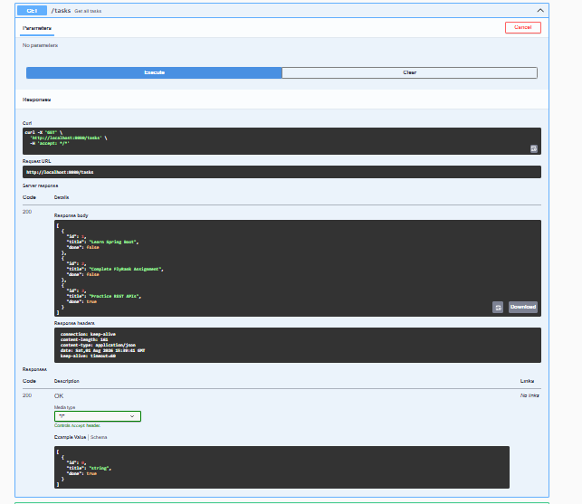
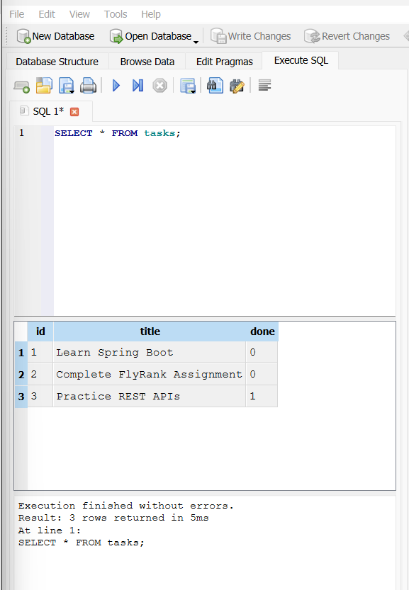
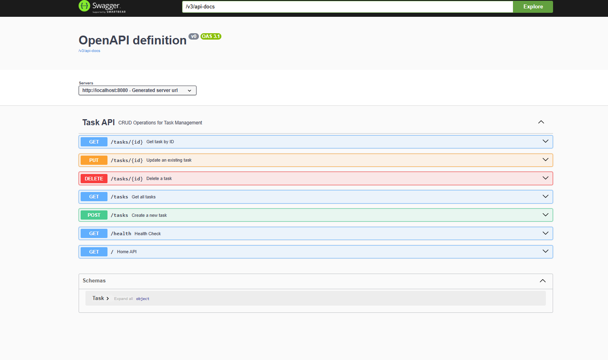
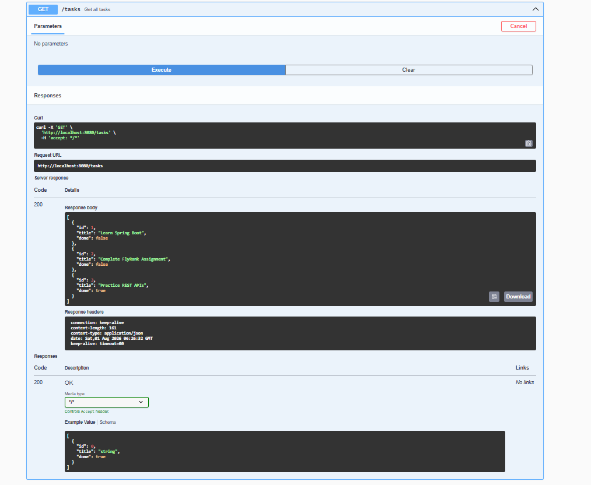
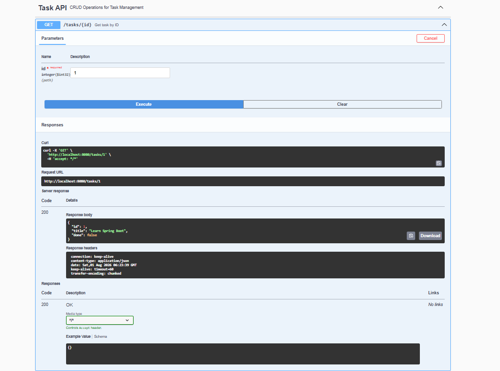
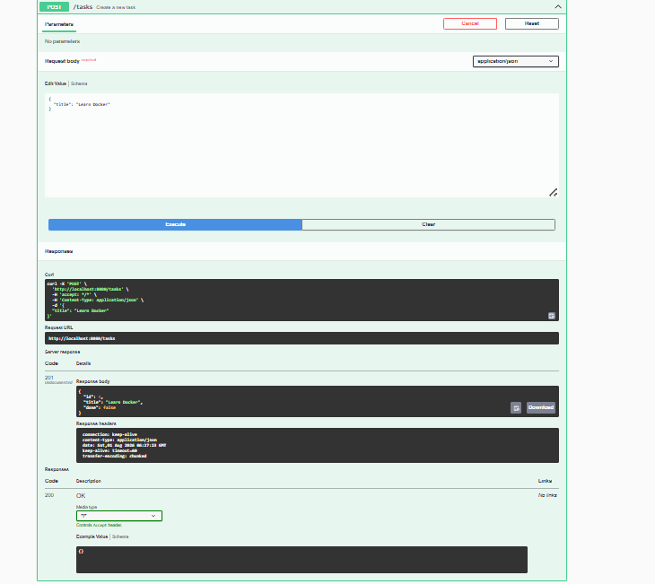
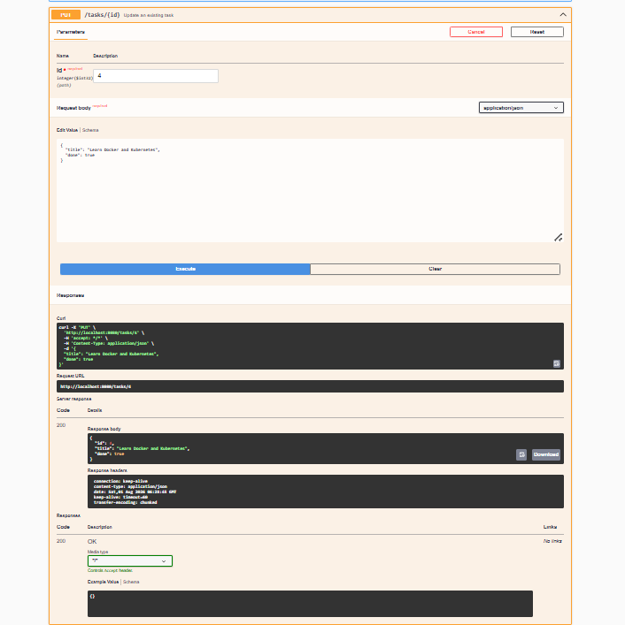
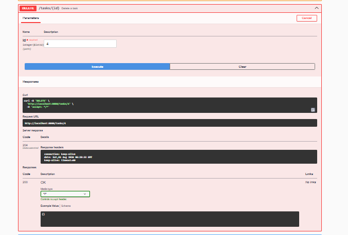

# FlyRank Backend AI Engineering Internship

# Week 3 – Assignment A2
## Connecting CRUD API to SQLite Database

---

## Overview

This assignment extends the Week 2 CRUD REST API by replacing the in-memory storage with a persistent SQLite database.

The REST API endpoints remain exactly the same, but task data is now stored inside a SQLite database (`tasks.db`), allowing data to survive application restarts.

---

## Technologies Used

- Java 21
- Spring Boot
- Spring Boot JDBC
- SQLite
- SQLite JDBC Driver
- Maven
- Swagger UI (OpenAPI)
- VS Code
- Git & GitHub

---

## Project Structure

```
Assignment-A2-Connecting-to-the-Database
│
├── README.md
├── screenshots
│   ├── sqlite-db-browser.png
│   ├── persistence-proof.png
│   ├── sql-query.png
│   ├── swagger-home.png
│   ├── swagger-get-all.png
│   ├── swagger-get-by-id.png
│   ├── swagger-post.png
│   ├── swagger-put.png
│   └── swagger-delete.png
│
└── task-api
    ├── pom.xml
    ├── src
    ├── mvnw
    └── .gitignore
```

---

# Why SQLite?

SQLite was selected because:

- Lightweight database
- Zero configuration
- Serverless
- Stores everything in one database file
- Automatically creates the database
- Data persists after restarting the application

Unlike the previous assignment, tasks are no longer stored in memory.

---

# Database

Database File

```
tasks.db
```

The database is automatically created when the application starts.

The application automatically:

- Creates the tasks table
- Seeds three sample tasks
- Prevents duplicate seed data

---

# API Endpoints

| Method | Endpoint | Description |
|---------|----------|-------------|
| GET | / | Home |
| GET | /health | Health Check |
| GET | /tasks | Get All Tasks |
| GET | /tasks/{id} | Get Task by ID |
| POST | /tasks | Create Task |
| PUT | /tasks/{id} | Update Task |
| DELETE | /tasks/{id} | Delete Task |

---

# Status Codes

| Status | Meaning |
|----------|----------|
|200|Success|
|201|Created|
|204|Deleted Successfully|
|400|Invalid Request|
|404|Task Not Found|

---

# Sample SQL Query

```sql
SELECT * FROM tasks;
```

Output

```
1   Learn Spring Boot               0
2   Complete FlyRank Assignment     0
3   Practice REST APIs              1
```

---

# Running the Project

Clone the repository

```bash
git clone https://github.com/YOUR_USERNAME/flyrank-backend-ai-internship.git
```

Go to project

```bash
cd Week-03-Backend-Foundations/Assignment-A2-Connecting-to-the-Database/task-api
```

Run

```bash
mvn spring-boot:run
```

Application runs at

```
http://localhost:8080
```

Swagger UI

```
http://localhost:8080/swagger-ui.html
```

---

# Screenshots

## SQLite Database


---

## Persistence Proof

Tasks remain after restarting the application.



---

## SQL Query

Executed query:

```sql
SELECT * FROM tasks;
```



---

## Swagger API

### Home



### Get All Tasks



### Get Task By ID



### Create Task



### Update Task



### Delete Task



---

# Persistence Proof

1. Start the application.

2. Create a new task.

3. Stop the application.

4. Restart the application.

5. Call

```
GET /tasks
```

The created task still exists, proving that the SQLite database persists data.

---

# Assignment Requirements Completed

- SQLite database integration
- Automatic database creation
- Automatic table creation
- Seed data inserted only once
- CRUD operations using SQL
- Parameterized SQL queries
- Correct HTTP status codes
- Data persists after restart
- Swagger API documentation
- Database screenshots
- SQL query demonstration
- Public GitHub repository

---

# Author

**Achyuta Biswal**

FlyRank Backend AI Engineering Internship

Week 3 Assignment A2